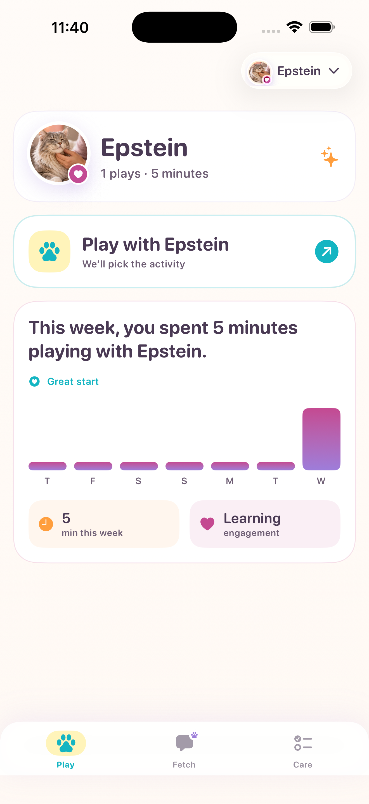
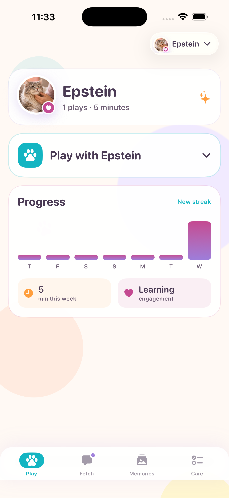

<div align="center">
  
  <h1>Pawprint</h1>
  <p><strong>Small moments. Happier pets.</strong></p>
  <p>A local-first iOS companion that turns a pet's needs, energy, and preferences into one realistic enrichment idea at a time.</p>

  <p>
    
    
    
    
  </p>
</div>

<p align="center">
  
  &nbsp;&nbsp;
  
</p>

## The idea

Pet enrichment advice is abundant; knowing what is safe, realistic, and right for *this pet today* is harder. Pawprint narrows that decision to a small activity an owner can actually do, explains why it fits, and learns from the pet's response.

The product is intentionally gentle: no guilt loops and no pressure to maintain a perfect streak. A useful three-minute interaction still counts.

## What the native app does

- **Builds a useful pet profile** through dog/cat onboarding, including age, size, energy, routine, constraints, and available materials.
- **Chooses a daily activity** from a typed, reviewed catalog using hard safety filters before preference scoring.
- **Explains the match** with materials, timing, step-by-step instructions, and a pet-specific reason.
- **Learns from play** through completion reactions, recent-history avoidance, favorites, swaps, and observed preferences.
- **Keeps pets separate** with multi-pet switching and isolated recommendation history.
- **Turns activity into memory** with optional photos and a cumulative scrapbook.
- **Answers locally with Fetch**, a pet-aware helper for activity constraints, profile questions, greetings, and name ideas—without sending a prompt to a server.
- **Tracks care alongside play** with household members, care tasks, notes, and completion history.

## How a recommendation is made

```text
pet profile + today's context + available materials
                         ↓
            hard safety eligibility checks
                         ↓
       preference, reaction, and recency scoring
                         ↓
       one explainable activity + safe alternates
```

Safety is a gate, not a ranking signal. An activity must be eligible for the pet before personalization can make it more likely to appear.

## Privacy by design

Pawprint currently has no account, analytics SDK, ad network, payment dependency, or remote backend. Profiles, activity history, favorites, care data, and memories are stored on-device with SwiftData. The app can run without a network connection or per-request AI cost.

Photos are optional. Pawprint's guidance is for enrichment and routine support, not veterinary diagnosis or treatment.

## Technical notes

| Area | Implementation |
| --- | --- |
| Interface | SwiftUI, responsive iPhone layouts, custom visual system |
| Persistence | SwiftData models with a recoverable in-memory fallback |
| Recommendation engine | Deterministic safety filtering, preference weighting, reaction learning, and recent-item avoidance |
| Content | Bundled JSON activity catalog with materials, instructions, categories, and safety notes |
| Local assistant | Intent routing and pet-aware response composition in Swift |
| Minimum platform | iOS 17 |
| Dependencies | Apple frameworks only |

## Run the iOS app

1. Open `Pawprint.xcodeproj` in Xcode 16 or newer.
2. Select the `Pawprint` scheme.
3. Choose an iPhone simulator running iOS 17 or newer.
4. Build and run.

To start every launch with a fresh in-memory profile, add `--phase-one-testing` to the Run scheme arguments. Remove it when validating persistence.

## Tests

The unit suite covers catalog decoding, safety filtering, reaction effects, deterministic rotation, recent-item avoidance, calming bias, activity swaps, pet isolation, library filters, local-assistant routing, and safe recommendation output.

```sh
xcodebuild test \
  -project Pawprint.xcodeproj \
  -scheme Pawprint \
  -destination 'platform=iOS Simulator,name=iPhone 16'
```

See [`PHASE_1_TESTING.md`](PHASE_1_TESTING.md) for the hands-on product QA path.

## Repository map

```text
Pawprint/
├── App/                 app entry point and visual tokens
├── Models/              SwiftData models and domain logic
├── Services/            activity library and local Fetch assistant
├── Views/               onboarding, daily play, memory, and care flows
├── Resources/           reviewed native activity catalog
└── Assets.xcassets/     icon, brand, and activity artwork

PawprintTests/           recommendation and behavior tests
Pawprint.xcodeproj/      native iOS project and shared scheme
pawprint-prototype.html  dependency-free interactive product prototype
activities-data.js       expanded 1,000-activity web catalog across 19 species
```

## Web product prototype

The repository also preserves the dependency-free browser prototype used to explore the broader multi-species concept. It includes a 1,000-activity structured catalog, daily matching, swaps, favorites, reactions, a scrapbook, filters, and local-storage persistence.

```sh
python3 -m http.server 4173
```

Then open `http://localhost:4173`. The root page redirects to `pawprint-prototype.html`.

## Product status

Pawprint is an actively developed local prototype, not an App Store release. The current native milestone focuses on trustworthy recommendations, a coherent daily loop, and on-device learning. Cloud sync, shared households across devices, production photo storage, notifications, payments, analytics, accessibility audits, and a remotely managed content system remain future work.

The product reasoning and longer-term direction live in [`pawprint-product-brief.md`](pawprint-product-brief.md).

---

Built and designed by [Zoya Khan](https://github.com/therealzoyak).
